# Digital Banking API

## Key Features
- Authentication
- Swagger UI
- Postman collection
- Automated testing (JUnit)
- Code Coverage report (Jacoco)
- Performance testing (JMeter)
- GitHub Actions
- Docker Compose


## Setting up database
1. Open a terminal (bash) 
2. Run `docker-compose up`
3. `docker exec -it digital-banking-db-1 mysql -uroot -ppassword`
4. Create a new database in your MySQL server named `springboot`:
```sql
CREATE DATABASE springboot CHARACTER SET utf8mb4 COLLATE utf8mb4_general_ci;
```
5. Open new terminal
6. Copy the following files from the assignment directory to `mock_data/`
  - user_greetings.sql
  - account_flags.sql
  - banners.sql
  - transactions.sql
  - debit_card_details.sql
  - account_balances.sql
  - debit_card_design.sql
  - account_details.sql
  - debit_cards.sql
  - users.sql
  - accounts.sql
  - debit_card_status.sql
7. Initial schema and mock data:
```shell
./mock_data/init_mock_data.sh
```
8. Stop all containers:
```shell
docker-compose down
```

## Running the application
```shell
docker build -t digital-banking .
```

```shell
docker-compose up
```

### Test User
username=user1   
password=password

### Swagger UI
Login to the application and navigate to the following URL to access the Swagger UI:
http://localhost:8080/swagger-ui/index.html

### Postman Collection
`postman_collection.json`

## Automated testing
```shell
./gradlew clean test
```

This will run all the tests in the project and generate a test report.  
You can check code coverage report (jacoco) in `build/reports/jacoco/test/html/index.html`

If the code coverage is 0%, you may need to run `docker-compose up` again to start the database container.  
Then run `./gradlew clean test -Ptest` again to generate the code coverage report.

## Performance testing
Open `src/test/resources/load_test.jmx` in JMeter and run the test.

## Database Tables

```mermaid
erDiagram
    users {
        varchar user_id PK
        varchar name
        varchar dummy_col_1
    }
    user_greetings {
        varchar user_id PK
        text greeting
        varchar dummy_col_2
    }
    accounts {
        varchar account_id PK
        varchar user_id
        varchar type
        varchar currency
        varchar account_number
        varchar issuer
        varchar dummy_col_3
    }
    account_balances {
        varchar account_id PK
        varchar user_id
        decimal amount
        varchar dummy_col_4
    }
    account_details {
        varchar account_id PK
        varchar user_id
        varchar color
        tinyint is_main_account
        int progress
        varchar dummy_col_5
    }
    account_flags {
        int flag_id PK
        varchar account_id
        varchar user_id
        varchar flag_type
        varchar flag_value
        timestamp created_at
        timestamp updated_at
    }
    banners {
        varchar banner_id PK
        varchar user_id
        varchar title
        text description
        varchar image
        varchar dummy_col_11
    }
    debit_cards {
        varchar card_id PK
        varchar user_id
        varchar name
        varchar dummy_col_7
    }
    debit_card_status {
        varchar card_id PK
        varchar user_id
        varchar status
        varchar dummy_col_8
    }
    debit_card_design {
        varchar card_id PK
        varchar user_id
        varchar color
        varchar border_color
        varchar dummy_col_9
    }
    debit_card_details {
        varchar card_id PK
        varchar user_id
        varchar issuer
        varchar number
        varchar dummy_col_10
    }
    transactions {
        varchar transaction_id PK
        varchar user_id
        varchar name
        varchar image
        tinyint isBank
        varchar dummy_col_6
    }

```

